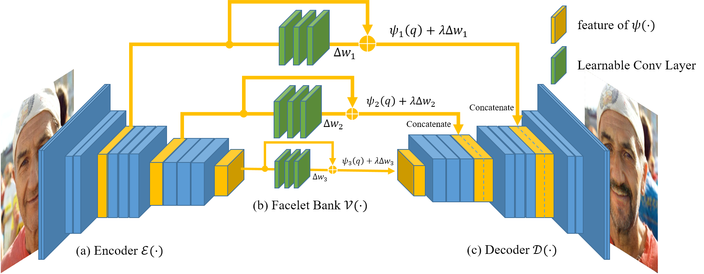
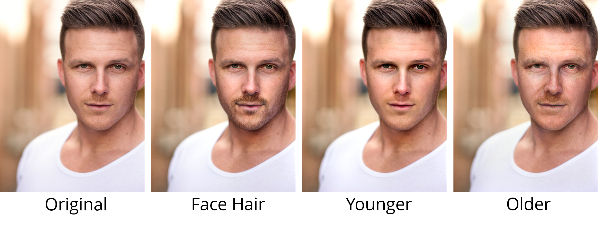

# Facelet-Bank for Fast Portrait Manipulation



## Prerequisites

- Python 2.7 or Python 3.6
- NVIDIA GPU or CPU (only for testing)
- Linux (for training and testing) or MacOS (only for testing)

## Getting Started

### Installation

Install pytorch from <http://pytorch.org>. The code is tested on 0.3.1 version. Other version should also work with some modification. 

Clone this project to your machine. 

```bash
git clone https://github.com/yingcong/Facelet_Bank.git
cd Facelet_Bank
```

Run 

```bash
pip install -r requirements.txt
```

to install other packages.

### How to use

We support testing on images and video. 

To test an image:

```bash
python test_facelet_net.py test_image --input_path examples/input.png --effect facehair --strength 5
```

Note that if "--input_path" is a folder, then it will test all images in this folder. 

To test a video:

```bash
python test_facelet_net.py test_video --input_path examples/input.mp4 --effect facehair --strength 5
```

The code will download required models automatically for the first time. If you cannot access the network, please use download the **facelet_bank** folder from [dropbox](https://www.dropbox.com/sh/zlx22zgunfl0ueh/AACwoywXOFqSzMnasFGFwjkDa?dl=0) or and put them in the root directory.

They are pretrained VGG encoder and VGG decoder respectively.

If you do not have a GPU, please include "-cpu" argument to your command. For speed issue, you can optionally use a smaller image by specifying the "--size " option. 

```bash
python test_facelet_net.py test_image --input_path examples/input.png --effect facehair --strength 5 --size 400,300 -cpu
```

For more details, please run

```bash
python test_facelet_net.py test_image --help
```

or

```bash
python test_facelet_net.py test_video --help
```

**Note:**  Although this framework is robust to an extent, testing on extreme cases could cause the degradation of performance. For example, an extremely high strength may cause artifact. Also, testing on an extremely large image may not work as well as testing on a proper size (from 448 x 448 to 600 x 800).

## More effects

The current project supports 

- facehair
- older
- younger

More effects will be available in the future. Please watch this project for more information. Once a new effect is released, the **global_vars.py** file will be updated accordingly. This file contains the link  of the facelet models.

## Results



## Training

Training our network requires two steps, i.e.,  generating the attribute vector (Eq. (6) in our paper) and training our model. 

### Generating attribute vector

We utilize the [Deep Feature Interpolation](https://github.com/paulu/deepfeatinterp) project to generate attribute vector to supervise our network. Please see <https://github.com/paulu/deepfeatinterp> for more details. 

After downloading all relevant data and installing all required packages, copy **DFI/demo2_facelet.py**  to the root directory of the DFI project. Then run 

```bash
python demo2_facelet.py --effect facehair --input_path images/celeba --npz_path attribute_vector
```

This extracts the *facehair* effect from *images/celeba* folder, and save the extracted images to *attribute_vector* folder. For more details, please run

```
python demo2_facelet.py --help
```

**Note:** In our implementation, we use the *aligned* version of [celebA](http://mmlab.ie.cuhk.edu.hk/projects/CelebA.html) dataset for training, and reshape the image to 448 x 448. It is desirable that the height and width of training image are divisible to 112 to avoid padding. 

From our experience, 2000~3000 samples should be enough for training a facelet model.

### Training Facelet model

After generating enough attribute vectors, we can utilize them to train a facelet model. Please run 

```bash
python train_facelet_net.py --effect facehair --input_path ../deepfeatinterp/images/celeba --npz_path ../deepfeatinterp/attribute_vector
```

For more details, please run

```bash
python train_facelet_net.py --help
```

## Reference

[Ying-Cong Chen](http://www.cse.cuhk.edu.hk/~ycchen), Huaijia Lin, Michelle Shu,  Ruiyu Li, [Xin Tao](http://www.xtao.website), Yangang Ye, [Xiaoyong Shen](http://xiaoyongshen.me), [Jiaya Jia](http://www.cse.cuhk.edu.hk/leojia), "Facelet-Bank for Fast Portrait Manipulation" ,* Computer Vision and Pattern Recognition (CVPR), 2018 [pdf](https://arxiv.org/abs/1803.05576) 

```bibtex
@inproceedings{Chen2018Facelet,
  title={Facelet-Bank for Fast Portrait Manipulation},
  author={Chen, Ying-Cong and Lin, Huaijia and Shu, Michelle and Li, Ruiyu and Tao, Xin and Ye, Yangang and Shen, Xiaoyong and Jia, Jiaya},
  booktitle={CVPR},
  year={2018}
}
```

## Contact

Please feel free to email me <yingcong.ian.chen@gmail.com> if you have any question or suggestion. 
